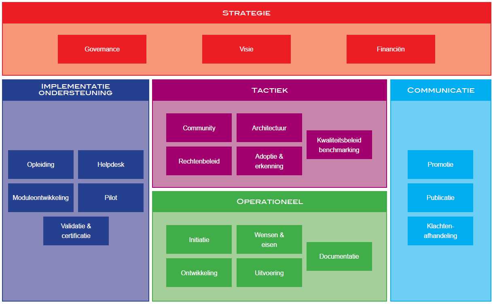

# Inleiding

## Leeswijzer

Dit document beschrijft hoe Logius open source code beheert. We doen dat volgens de principes van het Beheer- en Ontwikkelmodel voor Open Standaarden (BOMOS).  

### Bijlagen

Practische aspecten van het beheer, zoals de gebruikte applicaties
en webservices zijn opgenomen in bijlagen van dit document.
De bijlagen zijn niet specifiek voor een standaard maar zijn relevant
voor beheer bij Logius, zowel het beheer van standaarden als van 
open source code.

## OSDBK

TODO Beschrijf hier de OSDBK applicatie kort

### Toepassing

_Beschrijf hier toepassing en nut_

<aside class="example">
Een voorbeeld van de toepassing van OSDBK.
</aside>

### Werking

_Beschrijf hier de werking_

### Status

_Beschrijf hier de status_

<aside class="example" title="Status van de OSDBK code">
Bijvoorbeeld
</aside>

## BOMOS

Het activiteitendiagram toont welke lagen het model onderscheidt en welke activiteiten daarbinnen onderscheiden worden. De lagen en de ondersteunende
activiteiten worden hierna elk in een hoofdstuk besproken.

Niet alle ondersteunende activiteiten zijn van toepassing op het beheer van open source code. Deze activiteiten zijn immers bedoeld om het open beheer van _standaarden_ in te vullen. IN de volgende hoofdstukken worden wel alle activiteiten benoemd en uitgewerkt indien van relevant voor open source. 

Voor meer details of BOMOS verwijzen we naar de documentatie: [BOMOS, het fundament](https://gitdocumentatie.logius.nl/publicatie/bomos/fundament/) en [BOMOS, de verdieping](https://gitdocumentatie.logius.nl/publicatie/bomos/verdieping/)
